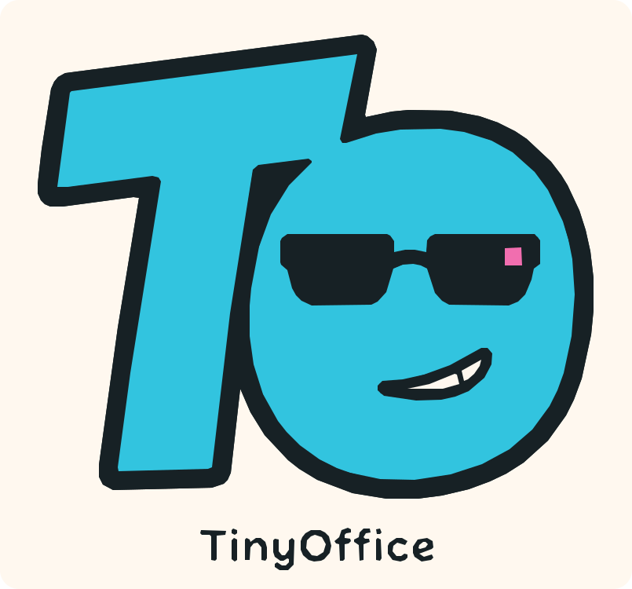

<p align="center">
  
</p>

<p align="center">
  <a href="README.md">English</a> · <a href="README.zh-CN.md">简体中文</a>
</p>

# TinyOffice

TinyOffice 是一个早期阶段、支持自托管的公司运营基础系统，面向长期存在的 AI 员工，以及与它们共同工作的人。它把类似 Slack / Discord 的协作工作区，与运行时会话、后台工作、执行证据和轻量治理能力组合在一起。

<!-- 为项目作者保留的创作者说明；在正式公开发布说明前由作者本人填写。 -->

> TinyOffice 是面向单一 Owner 的早期公开 Alpha 版本。本机使用一次性私有启动链接，远程访问使用通行密钥认证；面向互联网部署时，仍需自行配置 HTTPS、备份、主机更新和网络加固。

## 仓库内容

- `apps/tinyoffice-web-shadcn/`：基于 shadcn/ui 的独立前端
- `src/`：运行时、协作、治理、API 与存储代码
- `packages/`：可复用的运行时包
- `scripts/`：本地运行、验证、备份与文档工具
- `tests/`：运行时与契约测试
- `docs/`：产品手册，也是预期产品行为的事实来源

本地 Company 记录、员工工作区、上传资产、密钥、运行时数据库、截图和 QA 验收文件不会进入公开源码边界。

## 环境要求

- Node.js 22.19 或更高版本
- npm
- Docker，用于运行 PostgreSQL 本地运行时
- Windows 环境推荐使用 PowerShell 7 执行仓库脚本

## 本地运行

```powershell
npm run setup
npm run runtime:postgres:ensure
npm run runtime:postgres:init-schema
npm start
```

`setup` 会同时安装根目录运行时依赖和独立 shadcn 前端依赖。执行前请确认 `node --version` 为 Node.js 22.19 或更高版本。

TinyOffice Web 位于 `http://localhost:5175`，运行时 API 位于 `http://127.0.0.1:8095`。本机启动时，终端会打印一个私有的一次性访问链接；打开后会直接建立标准的数据库 Owner 会话，不需要输入密码，也不会弹出 Windows Hello。将 `TINYOFFICE_PUBLIC_ORIGIN` 配置为 HTTPS 域名后，远程访问则必须完成通行密钥初始化和登录。浏览器随后会继续进入 Company 创建流程；仓库不会附带隐藏用户或默认 Company。详细边界参阅 [Owner 认证](docs/product/owner-authentication.md)和[首次用户引导验收手册](docs/developer/runbooks/first-user-onboarding.md)。

常用检查：

```powershell
npm run check
npm test
npm run docs:build
npm run check:open-source
```

完整验证路径请参阅[开发运行手册](docs/developer/runbook.md)。

## 配置与数据边界

`.env.example` 仅用于说明可选环境变量。不要提交真实的供应商密钥或 Company 数据。TinyOffice 运行时数据应存放在 PostgreSQL 和已忽略的本地运行目录中，而不是源码仓库中。

## 项目状态与文档

`docs/` 中的 Markdown 产品手册记录了产品意图、当前范围、架构决策、实现映射和验证方式。建议从[产品手册](docs/index.md)和[功能地图](docs/product/feature-map.md)开始阅读。

本仓库是 TinyOffice 的正式公开仓库。从私有孵化阶段迁移到公开仓库的过程记录在[开源分发说明](docs/product/open-source-distribution.md)中。

## 贡献与安全

提交改动前请阅读 [CONTRIBUTING.md](CONTRIBUTING.md)。如果发现疑似安全问题，请按照 [SECURITY.md](SECURITY.md) 中的私密流程报告，不要创建公开 Issue。

## 许可证

TinyOffice 使用 [Apache License 2.0](LICENSE) 许可证。第三方归属信息记录在 [THIRD_PARTY_NOTICES.md](THIRD_PARTY_NOTICES.md) 中。
