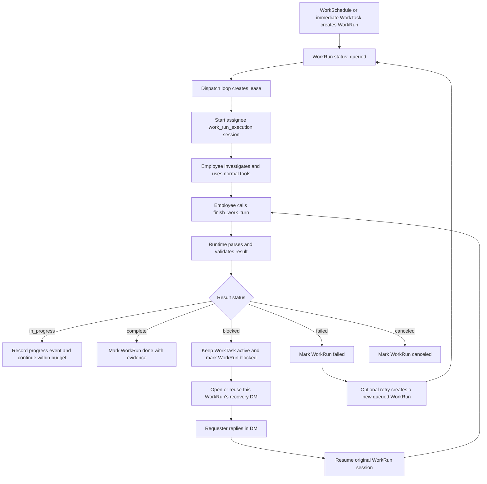

# Work Runtime Flow

This page explains how a WorkRun moves from queue to execution to a terminal or blocked state.



## Execution Principles

- WorkRun state is advanced only through `finish_work_turn`.
- Runtime is the only writer of WorkRun state.
- `complete` must include evidence.
- `blocked` must explain the blocker.
- A blocker needs one concise reason; it does not require a product-level blocker taxonomy.
- A WorkRun owns one linked direct message between the assignee and requester for its whole lifecycle. Repeated blockers reuse it.
- A requester reply wakes the original WorkRun Session. It does not itself clear the blocker; the employee's turn result determines the next WorkRun state.
- Tasks does not expose a manual "resume from participant" action; the recovery path is the linked DM conversation.
- Tasks does not create `blocked` state directly. It can cancel active work, retry a failed dispatch, or create a new retry WorkRun from a failed attempt.
- AI can cancel, archive, restore, or retry Work and pause, resume, or cancel schedules after explicit operator confirmation in Chat.
- The WorkRun result schema has no approval fields; Access is created only by the concrete tool/access layer.
- Sensitive-resource Access requests are created by the concrete tool/access layer when the employee touches the resource.
- Ordinary messages can clarify an Access request but cannot grant permission. Only an Access decision creates a grant.
- `in_progress` means the turn made progress but is not terminal; Runtime decides whether to continue within budget.
- A need to change assignee is reported as `blocked`; WorkRun reassignment is not exposed until it has real ownership and continuation semantics.
- Canceling a Task or Run aborts the exact `work_run_execution` Session, cancels dispatch ownership, closes recovery, and suppresses late provider results.

## Relationship To Collaboration

- Intake can create background Work through `finish_intake_turn` `create_work`.
- Channel Topic handoff uses Chat `handoff_topic_turn` to update Topic owner.
- WorkRun completion, blocker, failure, and cancellation do not directly change Topic owner.
- Blocked recovery messages are normal TinyOffice Chat DMs with WorkRun runtime links, so the requester can ask follow-up questions before the employee resumes or cancels the work.
- Access requests can be associated with WorkRun or foreground contexts, but approval does not make Runtime execute a business continuation by itself.

## Verification

```powershell
node --import tsx --test tests\work\work-execution-service.test.ts tests\runtime\postgres-schema.test.ts
```
